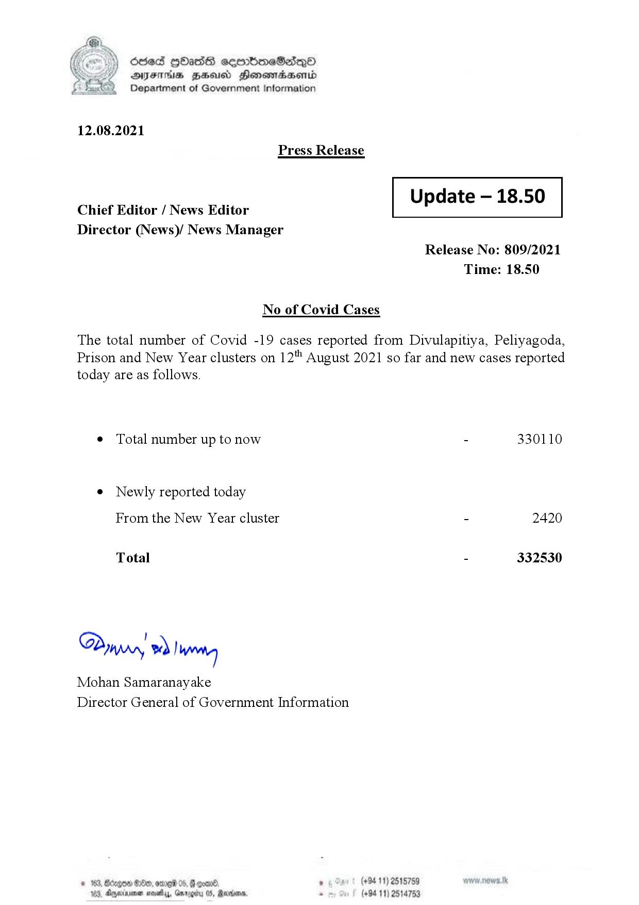

# Press Release  - 2021.08.12 
Key: ff070d182882026db38702773ea87625 

---
```
) ésed |HHasS seenbmeSad—o
DFS HHS Hensrradaentd
Department of Government Information

 

12.08.2021
Press Release

 

Update — 18.50

 

 

Chief Editor / News Editor
Director (News)/ News Manager

 

Release No: 809/2021
Time: 18.50

No of Covid Cases

The total number of Covid -19 cases reported from Divulapitiya, Peliyagoda,
Prison and New Year clusters on 12" August 2021 so far and new cases reported
today are as follows.

¢ Total number up to now - 330110
e Newly reported today
From the New Year cluster - 2420

Total - 332530

Dyry » |Wwreteg

Mohan Samaranayake
Director General of Government Information

% , (+94 11) 2515759
163, Dgyeriryenen ase, Garogity 05, Revrdoma, - (+94 11) 2514753

 

```
