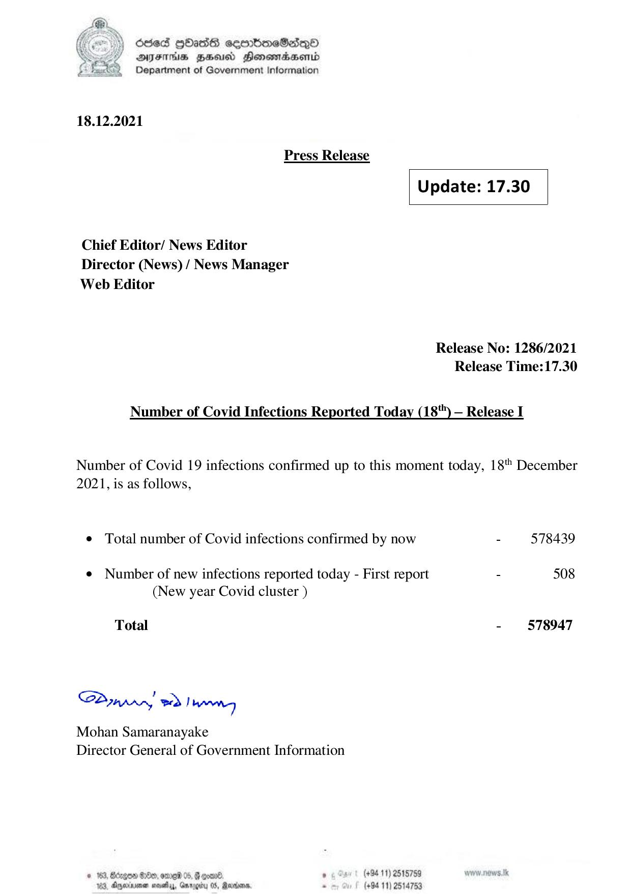

# Press Release - 2021.12.18 
Key: ff3b81e19a3e2ad0c1ff8b1c364e60e5 

---
```
) dcded QhasS ceerbneSdiqQo
DFTs HH Honsomadsenid
Department of Government Information

 

 

18.12.2021
Press Release
Update: 17.30
Chief Editor/ News Editor
Director (News) / News Manager
Web Editor

Release No: 1286/2021
Release Time:17.30

Number of Covid Infections Reported Today (18") — Release I

Number of Covid 19 infections confirmed up to this moment today, 18" December
2021, is as follows,

© Total number of Covid infections confirmed by now - 578439

¢ Number of new infections reported today - First report - 508
(New year Covid cluster )

- 578947

Total

Sa mprr wd! bong

Mohan Samaranayake
Director General of Government Information

(+94 11) 2515759
(+94 11) 2514753

 

© 163, Bdzgon Oe, ore 05, B coal.
163, Apexnener sevethys, Garogiry 0S, Rare,

```
