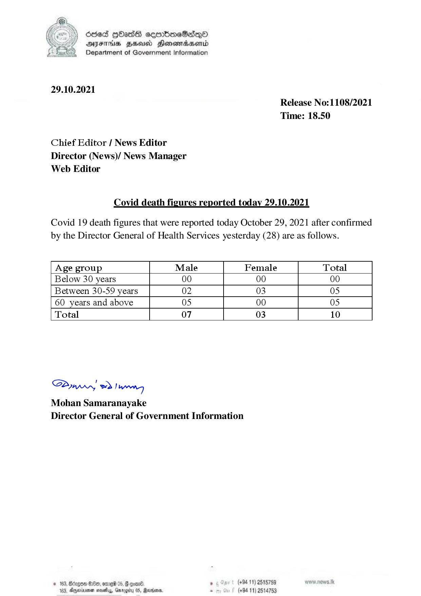

# Press Release - 2021.10.29  - Covid 19 infection deaths 
Key: ff6d0b1978ba2d71537c74f91b013618 

---
```
) dese HOadS seerboeSiqQo
AIFS FHA Honomasenid
Department of Government information

 

29.10.2021

Chief Editor / News Editor
Director (News)/ News Manager
Web Editor

Release No:1108/2021
Time: 18.50

Covid death figures reported today 29.10.2021

Covid 19 death figures that were reported today October 29, 2021 after confirmed
by the Director General of Health Services yesterday (28) are as follows.

 

 

 

 

 

 

 

 

Age group Male Female Total
Below 30 years 00 00 00
Between 30-59 years 02 03 05
60 years and above 05 00 05
Total 07 03 10

 

 

 

Saw eo) wn
Mohan Samaranayake
Director General of Government Information

 

#163, Bdegon S180, anne 05, & goane . (+94 11) 2518759
183, Ageia savy, Gnrogiru 05, Rares - (+94 11) 2514753

```
